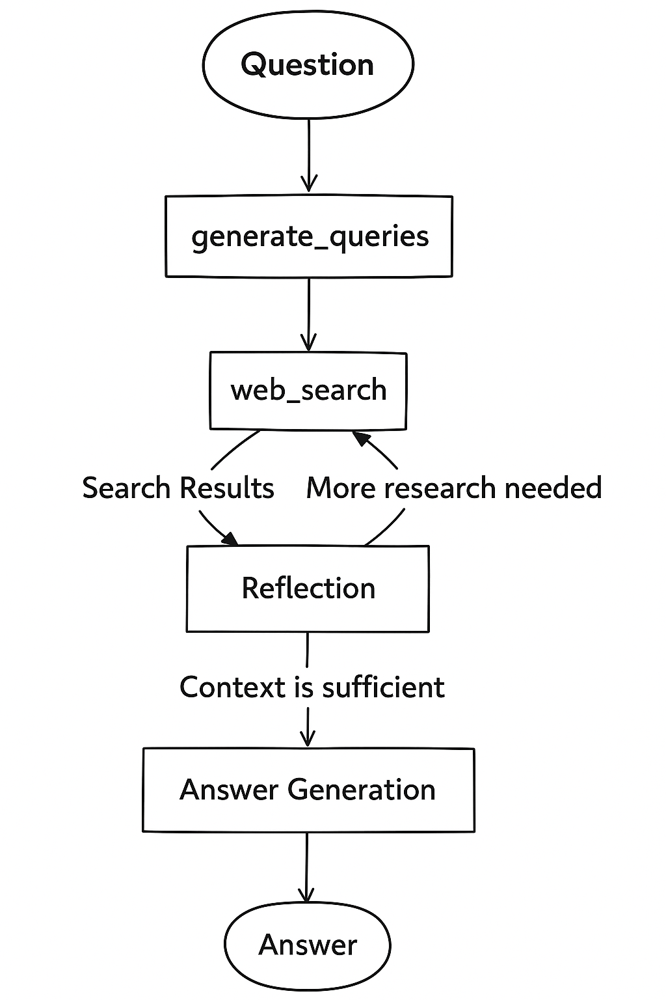

# DeepSeek Research Agent

An intelligent AI research assistant powered by DeepSeek and LangGraph that performs multi-step web research with automatic reflection and iteration.



## Features

- 🔍 **Intelligent Query Generation**: Automatically generates optimized search queries based on your research topic
- 🌐 **Web Research**: Uses Tavily Search API to gather information from multiple sources
- 🤔 **Reflection & Iteration**: Identifies knowledge gaps and performs follow-up research automatically
- 📊 **Real-time Streaming**: Watch the research process unfold in real-time
- 🔗 **Source Citations**: All answers include proper citations with links to sources
- 🎯 **Configurable Depth**: Choose low, medium, or high effort research modes

## Architecture

This project uses:
- **Backend**: LangGraph for orchestrating the multi-agent research workflow, DeepSeek for LLM capabilities, Tavily for web search
- **Frontend**: React 19 with TypeScript, TailwindCSS, and the LangGraph SDK for real-time streaming
- **Infrastructure**: In-memory state management (PostgreSQL/Redis optional for production)

See [ARCHITECTURE.md](ARCHITECTURE.md) for detailed workflow documentation.

## Prerequisites

- **Python 3.11+**
- **Node.js 18+**
- **uv** (Python package manager) - [Installation guide](https://github.com/astral-sh/uv)
- **DeepSeek API Key** - [Get it here](https://platform.deepseek.com/)
- **Tavily API Key** - [Get it here](https://tavily.com/)

**New to this project?** Start with [QUICKSTART.md](QUICKSTART.md) for a 5-minute setup guide!

## Quick Start with UV (Recommended for macOS)

### 1. Install UV

```bash
curl -LsSf https://astral.sh/uv/install.sh | sh
```

### 2. Clone and Setup

```bash
# Clone the repository
git clone <repo-url>
cd reasearch-chatbot
```

### 3. Setup Backend

```bash
cd backend

# Create virtual environment with uv
uv venv

# Activate the virtual environment
source .venv/bin/activate  # On macOS/Linux
# or
.venv\Scripts\activate     # On Windows

# Install dependencies
uv pip install -e .

# Create .env file with your API keys
cat > .env << EOF
DEEPSEEK_API_KEY=your_deepseek_api_key_here
TAVILY_API_KEY=your_tavily_api_key_here
LANGSMITH_API_KEY=optional_langsmith_key_for_debugging
EOF
```

**Important**: Replace the placeholder values with your actual API keys!

### 4. Setup Frontend

```bash
cd ../frontend

# Install dependencies
npm install
```

### 5. Run the Application

**Option A: Using Make (Easiest)**

```bash
# From project root
make dev
```

**Option B: Manual (Two Terminals)**

Terminal 1 (Backend):
```bash
cd backend
source .venv/bin/activate
langgraph dev
```

Terminal 2 (Frontend):
```bash
cd frontend
npm run dev
```

### 6. Access the Application

- **Frontend**: http://localhost:5173
- **Backend API**: http://localhost:2024

## Getting API Keys

### DeepSeek API Key

1. Visit [https://platform.deepseek.com/](https://platform.deepseek.com/)
2. Sign up or log in
3. Navigate to API Keys section
4. Create a new API key
5. Copy and paste it into your `.env` file

### Tavily API Key

1. Visit [https://tavily.com/](https://tavily.com/)
2. Sign up for a free account
3. Go to your dashboard
4. Copy your API key
5. Paste it into your `.env` file

### LangSmith API Key (Optional)

LangSmith is useful for debugging and monitoring your agent:

1. Visit [https://smith.langchain.com/](https://smith.langchain.com/)
2. Sign up or log in
3. Create an API key
4. Add it to your `.env` file

## Alternative: Manual Setup Without UV

If you prefer using standard Python tools:

```bash
# Backend setup
cd backend
python3 -m venv .venv
source .venv/bin/activate  # On macOS/Linux
pip install -e .

# Create .env file (same as above)
# Then run: langgraph dev

# Frontend setup (in new terminal)
cd frontend
npm install
npm run dev
```

## Development Commands

```bash
# Start both frontend and backend
make dev

# Start only frontend
make dev-frontend

# Start only backend
make dev-backend

# Run tests (backend)
cd backend && pytest

# Lint code
cd backend && ruff check .
cd frontend && npm run lint
```

## Usage

1. Open the application in your browser
2. Enter your research question in Chinese or English
3. Select the research effort level:
   - **Low**: 1 initial query, max 1 research loop
   - **Medium**: 3 initial queries, max 3 research loops
   - **High**: 5 initial queries, max 10 research loops
4. Select the DeepSeek model to use (default: deepseek-chat)
5. Click "发送" to start the research
6. Watch the agent work through its research process in real-time
7. Review the final answer with citations

## Project Structure

```
reasearch-chatbot/
├── backend/
│   ├── src/agent/
│   │   ├── graph.py              # Main LangGraph workflow
│   │   ├── state.py              # State definitions
│   │   ├── prompts.py            # AI prompts (Chinese)
│   │   ├── tools_and_schemas.py  # Pydantic schemas
│   │   ├── configuration.py      # Agent configuration
│   │   └── app.py                # FastAPI app
│   ├── examples/
│   │   └── cli_research.py       # CLI example
│   ├── pyproject.toml            # Python dependencies
│   └── langgraph.json            # LangGraph configuration
├── frontend/
│   ├── src/
│   │   ├── App.tsx               # Main React app
│   │   └── components/           # React components
│   ├── package.json              # Node dependencies
│   └── vite.config.ts            # Vite configuration
├── Makefile                      # Development commands
└── README.md                     # This file
```

## Troubleshooting

### Port Already in Use

```bash
# Check what's using the port
lsof -i :2024  # Backend
lsof -i :5173  # Frontend

# Kill the process if needed
kill -9 <PID>
```

### Module Not Found Error

```bash
# Make sure your virtual environment is activated
source backend/.venv/bin/activate

# Reinstall dependencies
cd backend
uv pip install -e .
```

### API Key Errors

- Verify your API keys are correct in the `.env` file
- Make sure there are no extra spaces or quotes around the keys
- Check that the `.env` file is in the `backend/` directory

### Frontend Can't Connect to Backend

- Ensure backend is running on port 2024
- Check `frontend/src/App.tsx` line 25-27 for the correct API URL
- In development, it should point to `http://localhost:2024`

### Virtual Environment Issues

- Make sure to activate the virtual environment before running backend commands
- If you see import errors, try reinstalling: `uv pip install -e .` in the backend directory
- Check Python version: requires 3.11 or higher

## Contributing

Contributions are welcome! Please feel free to submit a Pull Request.

## License

This project is licensed under the Apache 2.0 License - see the [LICENSE](LICENSE) file for details.

## Acknowledgments

- Built with [LangGraph](https://github.com/langchain-ai/langgraph)
- Powered by [DeepSeek AI](https://www.deepseek.com/)
- Search provided by [Tavily](https://tavily.com/)
- UI components from [shadcn/ui](https://ui.shadcn.com/)

